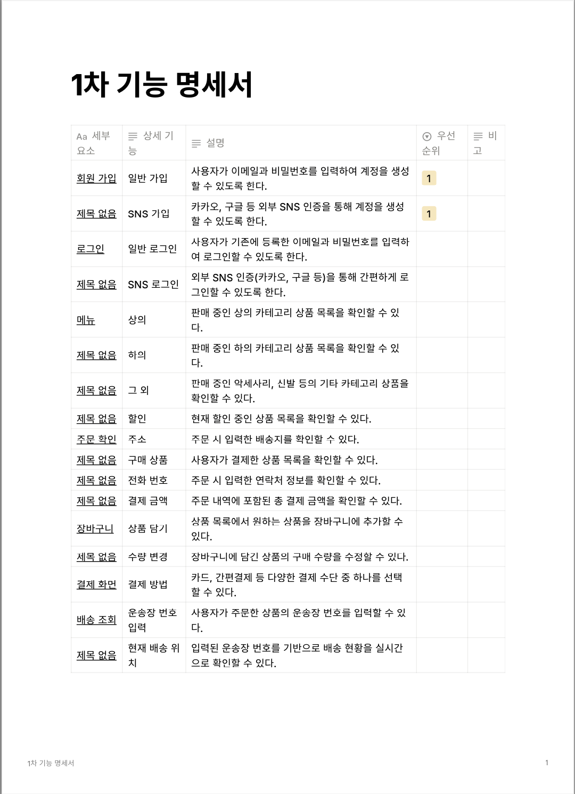

## <개발 실전 스터디 1주차 WIL>

### 이번주 스터디 목표
- 프로젝트 사이클에 대해 이해하고 기능 명세서를 작성해보자

### 오늘의 키워드
- 프로젝트 사이클 이해
- 협업 마인드셋
- 기획 문서 구성 요소 (기능 명세서, API 명세서 등)

### 1. 프로젝트의 한 사이클
- 프로젝트는 기획, 개발, 유지 보수의 순으로 진행된다.

#### 1-1. 기획
- 프로젝트 컨벤션이란?  
-> 프로젝트를 시작하기 전에 팀원들과 모든 요소들에 대해 충분히 이야기를 나누고 규칙을 정해야 한다.
- 아이디에이션  
-> 기획 단계에서 힘을 주는 정도에 따라 방향성이 달라지기 때문에 아이디어를 만들어내고 고도화하는 과정을 한다.
- 타켓 리서치  
-> 아이디에이션에서 검증이 필요한 부분을 타겟을 설정해 설문을 진행하여 타당성을 높인다.  
-> 가설을 세우고 검증하는 방식으로 목표 지점을 뚜렷하게 해야 한다.
- 기능 명세서  
-> 어떤 기능이 어떻게 필요한지에 대해 내용을 상세히 정리해야한다.  
-> 기능 명세서를 기반으로 API 명세, 와이어프레임이 만들어지기 때문이다.
- IA  
-> 화면에 어떤 정보들을 보여줄 지 구조로 시각화하여 다뤄본다.
- ERD  
-> 데이터베이스에 어떤 정보들이 들어가야 하는지 각 정보들은 어떤 관계를 가져야하는 지를 정의해야 한다.
- API 명세서  
-> 프론트엔드와 백엔드 간의 소통에 대해 정리한다.
- 와이어프레임  
-> 어떤 화면에 어떤 위치에 어떤 요소가 있어야 사용자 측면에서 잘 상호작용이 가능한지에 대해 명시해야 헙업이 수월하다.

#### 1-2. 개발
- GitHub 컨벤션  
-> 같이 개발하는 팀원 간에 규칙들을 미리 정해야 한다.
- GPT와 함께하는 개발  
-> 개발과정에서 AI의 활용은 자유이나 과도한 활용은 개인적인 성장에 걸림돌이 될 수 있다.
- 코드 리뷰  
-> 팀원들이 작성한 코드를 같이 검토하는 것을 통해 다양한 방식의 대안이나 수정사항이 나올 수도 있다.
-> 그로 인해 성능향상도 기대할 수 있다.

#### 1-3. 유지보수
- 프로젝트 배포  
-> 프로젝트를 어떻게 배포하고 관리할지를 미리 정해야 한다.
- 팀원들과의 방향성 설정  
-> 유지보수 단계는 프로젝트가 성공적으로 진행해 왔다는 것을 의미한다.  
-> 앞으로의 미래성을 판단하는 것도 중요하다.

### 2. 협업을 하기 위한 준비
- 협업의 기본은 소통이다.  
-> 다양한 협업 툴이 존재하므로 공부해두는 것이 좋을 것 같다.

### 3. 공부한 것
추가적으로 슬랙에 대해 공부해 보았다.  

### 4. 과제

### 느낀점
역시 프로젝트는 뚝딱 만들어지는게 아니다.

### 다음 스터디 목표
아마 IA 그려보는게 좋을 것 같다.